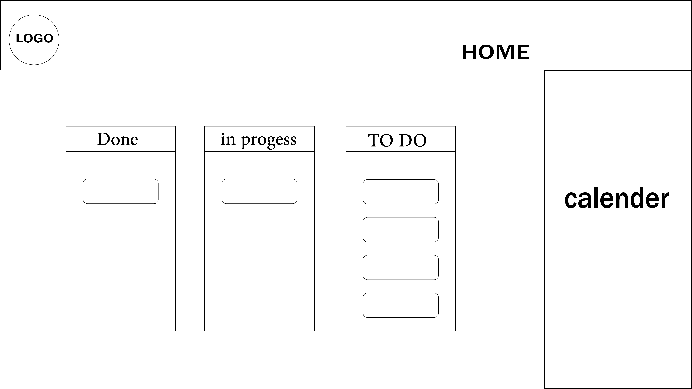

# requirements.md
## Vision
The main idea is to provide an app that helps people in manage their time by list their tasks in an easy way to increase their productivity and put hands to control their projects.
This app will have a friendly interface that helps people to handle their tasks in easy way and remind them if they missed any task.
This app will be free and easy to use.
## This product will do
Provide calender to put your future task
Will render your daily task
Will provide a timer for each task
Will provide a seperate section for thinges done and in progress and what next
## What will your product not do
This app won't to send notifications for the task

## Minimum Viable Product
Task Classification: 
Add a task classification feature or create different categories to organize and arrange tasks, such as daily chores, important chores, personal tasks.

Task Management:
Users can create new tasks with a title and optional description.
Users can view a list of their tasks, sorted by date or priority.
Users can mark tasks as complete or incomplete.
Users can edit and update task details such as title, description, and priority.
Users can delete tasks they no longer need.

Task Sorting and Filtering:
Users can sort tasks by due date, priority, or completion status.
Users can filter tasks based on specific criteria such as completion status or priority.

Task Reminders:
Users can set reminders for specific tasks to receive notifications or alerts.
Reminders can be set for a specific date and time or a recurring schedule.

## Our stretch goals aim 
to be the most visit app and we will provide a new features and make it a project managment system

## Functional Requirements
all users will ba able to put their task and updated it when ever they want 

## data flow

User Interaction:
The user interacts with the user interface of the to-do list app, including creating tasks, updating task details, marking tasks as complete.
The user may also interact with settings or preferences related to the app.

Client-side Processing:
The user's actions and input are processed on the client-side using JavaScript and React.

API Communication:
The client-side sends requests to the server-side API to perform operations such as creating tasks, updating task details, retrieving task lists, etc.
These requests are typically made using HTTP methods like POST, GET, PUT, DELETE.

Server-side Processing:
The server receives the API requests from the client-side and processes them.

Database Interaction:
The server interacts with the database ( PSQL) to store and retrieve task data.
Database operations include inserting new tasks, updating existing tasks, fetching task lists.

Response Generation:
The server generates appropriate responses based on the API request and database interactions.
Responses may include success messages, error messages, updated task lists, or other relevant data.

Client-side Update:
The client-side receives the API response and updates the user interface accordingly.
This may include displaying success or error messages, updating task lists, refreshing data.

## Non-Functional Requirements
User Interface (UI) Design:

Ensure a user-friendly and visually appealing interface.

Implement responsive design for different devices.

Consider accessibility for users with disabilities.

Scalability:
Design the application to handle a growing number of users and tasks.
Consider horizontal scaling options like load balancing and clustering.

Reliability:
Handle errors gracefully.
Implement proper error logging and monitoring

Cross-Browser Compatibility:
Test the application across different web browsers.
Address browser-specific issues and ensure compatibility with older versions.

Cross-Device Compatibility:
Ensure compatibility with various devices (desktops, laptops, tablets, mobile phones).
Test on different screen sizes and resolutions.
Optimize the user experience accordingly.

Error Handling and Reporting:
Implement clear and informative error messages.
Log errors and exceptions for debugging.
Provide troubleshooting resources for users.